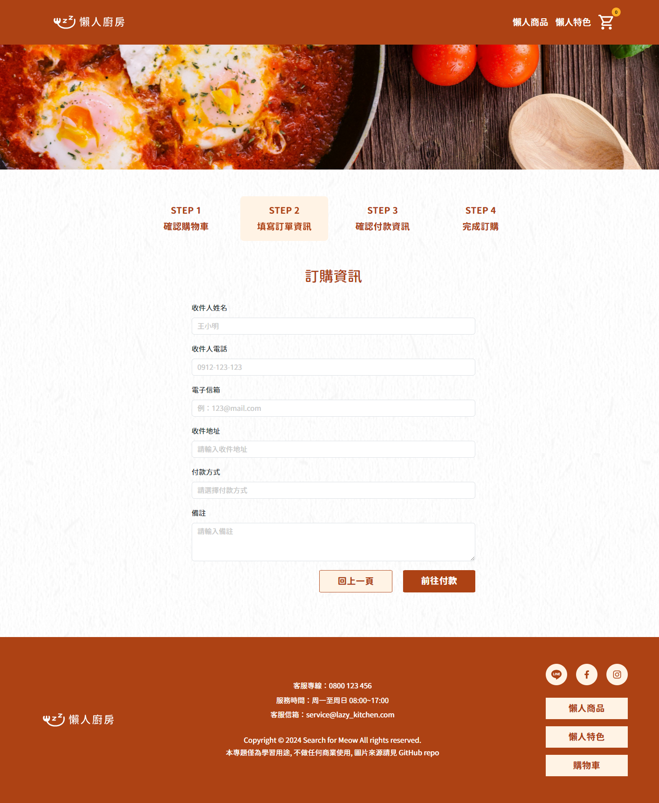

#  懶人廚房

* [GitHub repo](https://github.com/oriascrius/LazyKitchen/tree/feature/qoq)
* [gh-pages](https://oriascrius.github.io/LazyKitchen/)

---

## 程式專題作者

  - [泊岸](https://github.com/oriascrius): 前端開發
  - [Chewsday](): 前端開發
  - [翎光乍現](): 前端開發

---

## 前端技術

---

## 設計軟體

## 溝通、協作

---

##  網站導覽
### 首頁

### 商品列表

### 商品細項

### 購物車

### 訂單資訊

### 付款資訊

### 完成訂購

---

### 特別感謝 - 專題指導
  - 六角學院 / 卡斯柏 老師
  - 專題教練 / [樂樂 教練](https://github.com/PinyiW0)
  - 六角學院 / 助教群

---

### 圖片素材來源
- [Midjourney](https://www.midjourney.com/home)
- [Pixels](https://www.pexels.com/zh-tw/)
<!-- - [Unsplash](https://unsplash.com/) -->

---

本專題僅為學習用途,不做任何商業使用

---